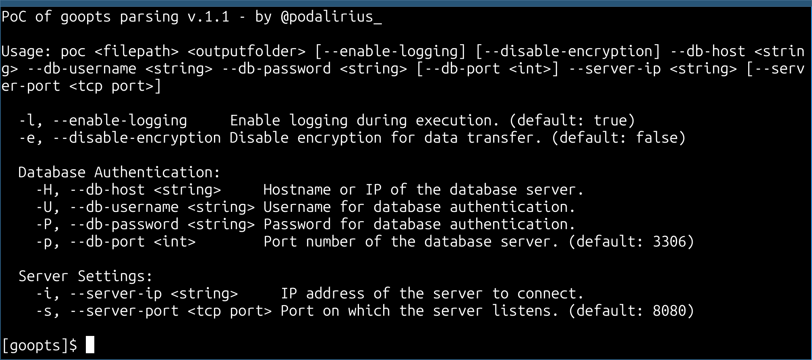

<p align="center">
    goopts, a Go library to parse arguments given in command line to a program.
    <br>
    <a href="https://github.com/p0dalirius/goopts/actions/workflows/unit_tests.yaml" title="Build"></a>
    
    <a href="https://twitter.com/intent/follow?screen_name=podalirius_" title="Follow"></a>
    <a href="https://www.youtube.com/c/Podalirius_?sub_confirmation=1" title="Subscribe"></a>
    <br>
</p>

goopts is a powerful and flexible library designed to simplify the parsing of command-line arguments in Go applications. Inspired by popular argument parsing libraries from other languages, goopts aims to provide developers with a robust, easy-to-use interface for handling various argument types, including positional arguments, named options, flags, and more. The library also supports advanced features like argument groups, mutually exclusive options, and dependency handling, making it an excellent choice for building feature-rich CLI tools.

Whether you are developing a simple utility or a complex command-line application, goopts offers the tools you need to parse and manage user input efficiently and effectively.

## Purpose

The purpose of goopts is to:

- Provide a straightforward and intuitive way to define and parse command-line arguments.
- Support multiple types of arguments including strings, integers, booleans, lists, and maps.
- Enable the grouping of arguments, including mutually exclusive groups and dependent arguments.
- Offer clear, customizable help messages for your command-line tools.
- Allow for flexible configuration and easy integration into existing Go projects.

## Documentation

- [1. Getting Started](./vendor/docs/1.%20Getting%20Started/README.md)
    - [1.1 Installation Instructions](./vendor/docs/1.%20Getting%20Started/1.%20Installation%20Instructions/README.md)
    - [1.2 Basic Example of Setting Up goopts](./vendor/docs/1.%20Getting%20Started/2.%20Basic%20Example%20of%20Setting%20Up%20goopts/README.md)
    - [1.3 Positional vs. Named Arguments](./vendor/docs/1.%20Getting%20Started/3.%20Positional%20vs.%20Named%20Arguments/README.md)
- [2. Examples](./vendor/docs/2.%20Examples/README.md)
    - [2.1. Basic Example](./vendor/docs/2.%20Examples/1.%20Basic%20Example/README.md)
    - [2.2. Parsing HTTP Headers and Other Advanced Use Cases](./vendor/docs/2.%20Examples/2.%20Parsing%20HTTP%20Headers%20and%20Other%20Advanced%20Use%20Cases/README.md)
    - [2.3. Complex CLI Tool with Multiple Groups](./vendor/docs/2.%20Examples/3.%20Complex%20CLI%20Tool%20with%20Multiple%20Groups/README.md)
- [3. Positionals](./vendor/docs/3.%20Positionals/README.md)
    - [3.1. Integer Argument](./vendor/docs/3.%20Positionals/1.%20Integer%20Positional%20Argument/README.md)
    - [3.2. String Argument](./vendor/docs/3.%20Positionals/2.%20String%20Positional%20Argument/README.md)
- [4. Arguments](./vendor/docs/4.%20Arguments/README.md)
    - [3. Simple Argument Types](./vendor/docs/4.%20Arguments/3.%20Simple%20Argument%20Types/README.md)
        - [4.3.1. Boolean Argument](./vendor/docs/4.%20Arguments/3.%20Simple%20Argument%20Types/1.%20Boolean%20Argument/README.md)
        - [4.3.2. Integer Argument](./vendor/docs/4.%20Arguments/3.%20Simple%20Argument%20Types/2.%20Integer%20Argument/README.md)
        - [4.3.3. String Argument](./vendor/docs/4.%20Arguments/3.%20Simple%20Argument%20Types/3.%20String%20Argument/README.md)
    - [4. Complex Argument Types](./vendor/docs/4.%20Arguments/4.%20Complex%20Argument%20Types/README.md)
        - [4.4.1. TCP Port](./vendor/docs/4.%20Arguments/4.%20Complex%20Argument%20Types/1.%20TCP%20Port/README.md)
        - [4.4.2. List of Strings](./vendor/docs/4.%20Arguments/4.%20Complex%20Argument%20Types/2.%20List%20of%20Strings/README.md)
        - [4.4.3. Map of HTTP Headers](./vendor/docs/4.%20Arguments/4.%20Complex%20Argument%20Types/3.%20Map%20of%20HTTP%20Headers/README.md)
- [5. Argument Groups](./vendor/docs/5.%20Argument%20Groups/README.md)
    - [1. Mutually Exclusive Argument Groups](./vendor/docs/5.%20Argument%20Groups/1.%20Mutually%20Exclusive%20Argument%20Groups/README.md)
    - [2. Dependent Argument Groups](./vendor/docs/5.%20Argument%20Groups/2.%20Dependent%20Argument%20Groups/README.md)
- [6. Best Practices](./vendor/docs/6.%20Best%20Practices/README.md)
    - [1. Organizing Your Code with goopts](./vendor/docs/6.%20Best%20Practices/1.%20Organizing%20Your%20Code%20with%20goopts/README.md)
    - [2. Common Pitfalls and How to Avoid Them](./vendor/docs/6.%20Best%20Practices/2.%20Common%20Pitfalls%20and%20How%20to%20Avoid%20Them/README.md)

## Example code

Here is an example code to illustrate a few of the features of [goopts](https://github.com/p0dalirius/goopts):

```go
import (
	"fmt"

	"github.com/p0dalirius/goopts/parser"
)

var (
	// Positional arguments
	filePath     string
	outputFolder string

	// Authentication flags
	dbHost     string
	dbUsername string
	dbPassword string
	dbPort     int

	// Server settings flags
	serverIP   string
	serverPort int

	// Feature flags
	enableLogging     bool
	disableEncryption bool
)

func parseArgs() {
	// Create a new arguments parser with a custom banner
	ap := parser.ArgumentsParser{Banner: "PoC of goopts parsing v.1.1 - by Remi GASCOU (Podalirius)"}

	// Define positional arguments
	ap.NewStringPositionalArgument(&filePath, "filepath", "Path to the input file.")
	ap.NewStringPositionalArgument(&outputFolder, "outputfolder", "Destination folder for output.")

	// Define global flags
	ap.NewBoolArgument(&enableLogging, "-l", "--enable-logging", true, "Enable logging during execution.")
	ap.NewBoolArgument(&disableEncryption, "-e", "--disable-encryption", false, "Disable encryption for data transfer.")

	// Define an argument group for database authentication
	group_dbAuth, err := ap.NewArgumentGroup("Database Authentication")
	if err != nil {
		fmt.Printf("[error] Error creating ArgumentGroup: %s\n", err)
	} else {
		group_dbAuth.NewStringArgument(&dbHost, "-H", "--db-host", "", true, "Hostname or IP of the database server.")
		group_dbAuth.NewStringArgument(&dbUsername, "-U", "--db-username", "", true, "Username for database authentication.")
		group_dbAuth.NewStringArgument(&dbPassword, "-P", "--db-password", "", true, "Password for database authentication.")
		group_dbAuth.NewIntArgument(&dbPort, "-p", "--db-port", 3306, false, "Port number of the database server.")
	}

	// Define an argument group for server settings
	group_serverSettings, err := ap.NewArgumentGroup("Server Settings")
	if err != nil {
		fmt.Printf("[error] Error creating ArgumentGroup: %s\n", err)
	} else {
		group_serverSettings.NewStringArgument(&serverIP, "-i", "--server-ip", "", true, "IP address of the server to connect.")
		group_serverSettings.NewTcpPortArgument(&serverPort, "-s", "--server-port", 8080, false, "Port on which the server listens.")
	}

	// Parse the flags
	ap.Parse()
}
```

This results in the following arguments and usage printing:



## Contributing

Pull requests are welcome. Feel free to open an issue if you want to add other features.

## Credits
  - [@p0dalirius](https://github.com/p0dalirius) for the creation of the [goopts](https://github.com/p0dalirius/goopts) library before transferring it to TheManticoreProject.

