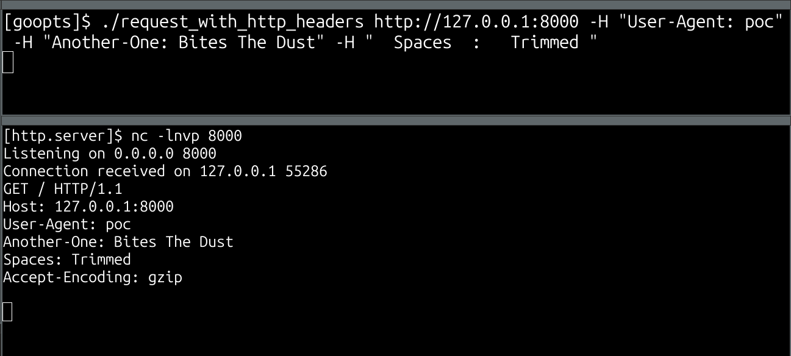

# HTTP Request Example Using goopts Parsing Library

This example demonstrates how to use the goopts argument parsing library to build a command-line tool for sending HTTP requests. The program accepts positional arguments, flags, and allows the user to specify multiple HTTP headers. This example uses:

- Positional arguments (e.g., the URL for the HTTP request)
- Named arguments (e.g., HTTP method, verbosity)
- List arguments (e.g., multiple headers)

## Program Description

### Positional Arguments

- `url (string)`: The URL to which the HTTP request will be sent. This is a required positional argument.

### Flags

- `-X`, `--method (string)`: Specifies the HTTP method to use for the request (e.g., GET, POST, PUT, DELETE). Default is GET.
- `-H`, `--header (map)`: Allows you to specify one or more HTTP headers. Each header must be formatted as Header-Name: Value. Multiple headers can be set by using the -H flag multiple times.
- `-v`, `--verbose (boolean)`: When enabled, provides detailed information about the HTTP request and response. Default is false.

### How to Run

Compile and run the example program using the following command:

```bash
go build -o request_with_http_headers
./request_with_http_headers <url> [options]
```

### Example Execution

```bash
./request_with_http_headers http://127.0.0.1:8000 -H "User-Agent: poc" -H "Another-One: Bites The Dust" -H "  Spaces  :   Trimmed "
```

When executed as shown above, the program sends a GET request to `http://127.0.0.1:8000` with the following headers:

```
User-Agent: poc
Another-One: Bites The Dust
Spaces: Trimmed
```

Using a simple netcat listener (`nc -lnvp 8000`) on the server, you can observe the following output:

```yaml
[http.server]$ nc -lnvp 8000
Listening on 0.0.0.0 8000
Connection received on 127.0.0.1 55286
GET / HTTP/1.1
Host: 127.0.0.1:8000
User-Agent: poc
Another-One: Bites The Dust
Spaces: Trimmed
Accept-Encoding: gzip
```



## Code Walkthrough

The program starts by setting up an ArgumentsParser with a banner message:

```go
ap := parser.ArgumentsParser{Banner: "PoC of goopts parsing - HTTP request example v1.0 - by @podalirius_"}
```

### Positional arguments

It then defines the arguments that will be used by the argument parser. The first one is a positional argument:

```go
ap.NewStringPositionalArgument(&url, "url", "URL to send the HTTP request to.")
```

### Named Arguments:

- `-X`, `--method`: To specify the HTTP method (default is GET)
    ```go
    ap.NewStringArgument(&method, "-X", "--method", "GET", false, "HTTP request method (e.g., GET, POST, PUT, DELETE).")
    ```

- `-H`, `--header`: To define multiple HTTP headers (stored as a map of strings)
    ```go
    ap.NewMapOfHttpHeadersArgument(&headers, "-H", "--header", map[string]string{}, false, "Header for the request (can be specified multiple times). Example: -H 'Authorization: Bearer token'")
    ```

- `-v, `--verbose`: To enable verbose output
    ```go
    ap.NewBoolArgument(&verbose, "-v", "--verbose", false, "Enable verbose mode to see detailed request and response information.")
    ```

